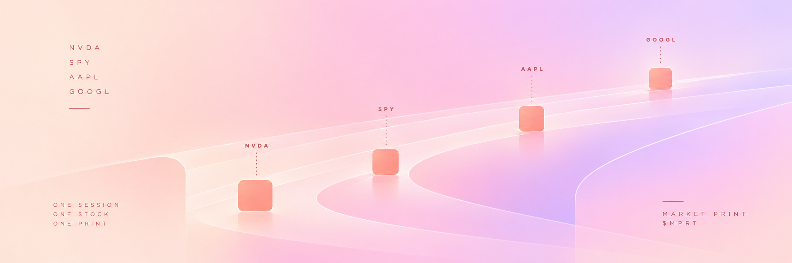

# MARKET PRINT

ONE SESSION.
ONE STOCK.
ONE PRINT.

Market Print turns every completed market cycle into a single shared output.

The protocol does not give each holder a different choice.

Every PRINT resolves into one asset from a fixed universe:

NVDA
SPY
AAPL
GOOGL

If a PRINT resolves to NVDA, every eligible holder receives their reward in NVDA.

The amount may differ.

The asset does not.

---

## LIVE

<!-- MARKETPRINT:LIVE:START -->

```
CURRENT PRINT        #000002
RESERVE              0.01383222818868765 ETH

[OPEN]        -> CLOSED        -> CONVERTING    -> FINALIZED
```

### LAST PRINT — #000001

```
  >  NVDA
     SPY
     AAPL
     GOOGL

RESERVE              0.854246671950587494 ETH
ACQUIRED             9 370 016 513 551 305 312
VERIFICATION         VERIFIED
```

Selected asset [`0x2d1f7226bd1f780af6b9a49dcc0ae00e8df4bdee`](https://etherscan.io/address/0x2d1f7226bd1f780af6b9a49dcc0ae00e8df4bdee) · [finalized transaction](https://etherscan.io/tx/0x0519b99ff4fb0dd0cb96e59930c6bf1d5761eff25aa83d602aad601ec788a6d9) · [receipt](prints/000001/receipt.json)

```
FINALIZED PRINTS     1
LAST VERIFIED BLOCK  26001052
ENGINE STATUS        SYNCED
```

Token [`0xe3004E6b1782120D434DA18b7C6575a06Cd0a607`](https://etherscan.io/address/0xe3004E6b1782120D434DA18b7C6575a06Cd0a607) · block [26001052](https://etherscan.io/block/26001052)

[Current](live/current.json) · [Latest](live/latest.json) · [Status](live/status.json) · [All PRINTs](prints/)

*Read from finalized Ethereum state through public RPC. Updated 2026-09-18T01:37:09.414Z.*

<!-- MARKETPRINT:LIVE:END -->

---

## THE MACHINE

Market Print runs in repeating cycles.

Trading activity builds the reward reserve.

The session closes and the next session opens immediately.

One asset is selected for the closed session.

The reserve is converted.

The PRINT becomes claimable.

Trading continues while older PRINTs await conversion. Each PRINT keeps its own reserve.

---

## THE UNIVERSE

Market Print is intentionally limited.

Only four market assets can ever become a PRINT:

NVDA
SPY
AAPL
GOOGL

No expanding list.
No individual selection.
No substitutions.

Four possible outputs.

One result per session.

---

## THE MARKET TAPE

This repository is the public history of the machine.

Every PRINT leaves a trace.

A completed session can be followed from:

OPEN

to

CLOSED

to

FINALIZED

and finally to its selected output.

The purpose of this repository is simple:

make every PRINT visible.

---

## CURRENT PRINCIPLE

ONE SESSION
→ ONE DECISION
→ ONE ASSET
→ EVERY ELIGIBLE HOLDER

---

## WHY MARKET PRINT EXISTS

Most reward systems end in the same asset every time.

Market Print does the opposite.

The reward changes with the session, while the rule stays fixed.

The protocol does not ask holders what they want to receive.

It produces one market-wide result and applies it equally to everyone.

---

## PRINT HISTORY

Each completed PRINT becomes part of a permanent sequence.

PRINT #001
PRINT #002
PRINT #003
PRINT #004
...

The sequence keeps moving forward.

The output can change.

The process does not.

---

## MARKET PRINT

100,000 MPRT

1% BUY
5% SELL

FOUR POSSIBLE OUTPUTS.

ONE OPEN PRINT.

OLDER PRINTS CAN AWAIT CONVERSION.
